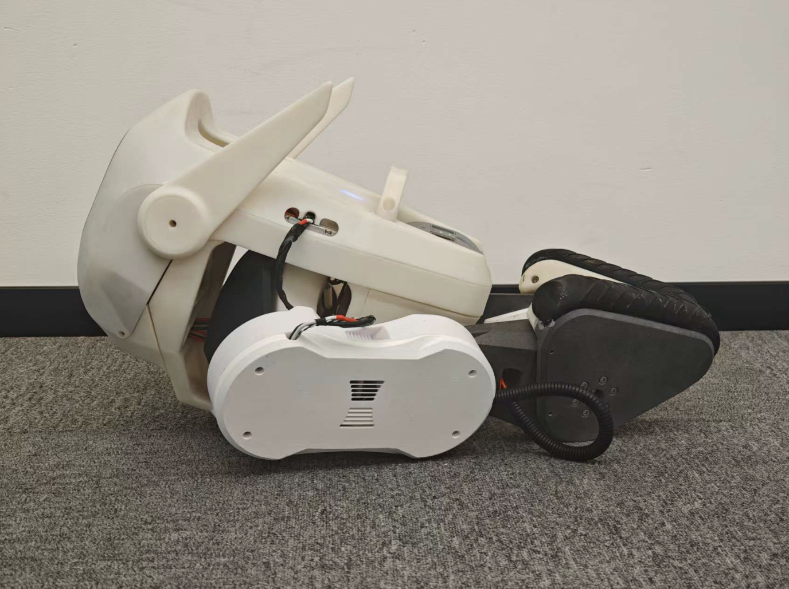

<div align="center">
  <h1 align="center">Qmini Deploy</h1>
  <p align="center">
    <span> 🌎English </span> | <a href="README_zh.md"> 🇨🇳中文 </a>
  </p>
</div>

---

## Environment Requirements

- OS: Ubuntu 20.04 or Ubuntu 22.04  
- CPU: aarch64 or x86_64  
- Compiler: gcc version 9.4.0 or higher

## Installing Dependencies

### Installing the Controller Library

Install the SDL2 library:
```bash
sudo apt install libsdl2-dev
```

To access the controller device, the current user needs to be added to the `input` group to avoid errors detecting the device. This change takes effect after a reboot.
```bash
sudo usermod -aG input $USER
```

### Installing the Serial Port Library

```bash
sudo apt install libserial-dev
```

### Installing the Matrix Operation Library

```bash
sudo apt install libeigen3-dev
```

## Build

```bash
cd qmini_deploy
mkdir build && cd build
cmake ..
make -j$(nproc)
```

## Usage

### Modifying the Configuration File Based on Hardware ID

Connect the USB-to-4-channel-485 module and IMU to the Qmini development board. Use the following command to check the hardware IDs:
```bash
ls /dev/serial/by-id/
```

Example output:
```
/dev/serial/by-id/usb-Silicon_Labs_CP2102_USB_to_UART_Bridge_Controller_0003-if00-port0
/dev/serial/by-id/usb-FTDI_USB__-__Serial_Converter_FTA5OHMV-if00-port0
/dev/serial/by-id/usb-FTDI_USB__-__Serial_Converter_FTA5OHMV-if01-port0
/dev/serial/by-id/usb-FTDI_USB__-__Serial_Converter_FTA5OHMV-if02-port0
/dev/serial/by-id/usb-FTDI_USB__-__Serial_Converter_FTA5OHMV-if03-port0
```
Based on the output, modify the corresponding port names in the `qmini_config.yaml` file.

### Robot Operation Instructions

Since the GO-M8010-6 motor uses a single encoder and cannot retain joint angles after power-off, the robot must be powered on in a fixed posture each time.

Position the robot in the following posture, ensuring it is in a head-up state with knee and ankle joints at their limits.

<div align="center">

| <div align="center"> Front View </div> | <div align="center"> Top View </div> |
|--- | --- |
|  |   |

</div>

Then run the following program:
```bash
cd qmini_deploy
./build/main
```

After the program starts, the robot's joints will automatically enter a damped state.

Lift the robot, press the **A** button on the controller to enter the locked standing state. The robot's joints will move to the designated positions within a few seconds, allowing it to stand statically when placed down.


<div align="center">
  
</div>


Press the **X** button on the controller to enter the reinforcement learning state. The robot will be in a reinforcement learning static standing mode, allowing it to move forward or sideways via remote control.

<div align="center">
  
</div>

Press the **B** button to return to the damped state.

The robot includes a built-in fall protection program. If the roll or pitch angle exceeds a certain threshold, the robot will assume it is about to fall and automatically enter the damped state.

## Auto-Start Configuration

### Overview

You can configure the Qmini robot to automatically run the program on startup, eliminating the need to manually execute commands each time.

### Creating an Auto-Start Script

Assuming the username is `ubuntu22`, create an auto-start script and grant it executable permissions:
```bash
vim /home/ubuntu22/qmini_startup.sh
sudo chmod +x /home/ubuntu22/qmini_startup.sh
```

Script content:
```
#!/bin/bash
sleep 3
cd /home/ubuntu22/qmini/qmini_deploy/build
sudo ./main
```

### Creating an Auto-Start Service

```bash
sudo vim /etc/systemd/system/qmini_startup.service
```

Service file content:
```
[Unit]
Description=Qmini Startup Service
After=network.target

[Service]
ExecStart=/home/ubuntu22/qmini_startup.sh
User=ubuntu22
Restart=always

[Install]
WantedBy=multi-user.target
```

### Enabling the Auto-Start Service

```bash
sudo systemctl enable qmini_startup.service
```

### Granting Permissions to the Executable

```bash
sudo visudo
```

Add the following line at the end of the file:
```
ubuntu22 ALL=(ALL) NOPASSWD: /home/ubuntu22/qmini/qmini_deploy/build/main
```

### Reboot

```bash
sudo reboot
```