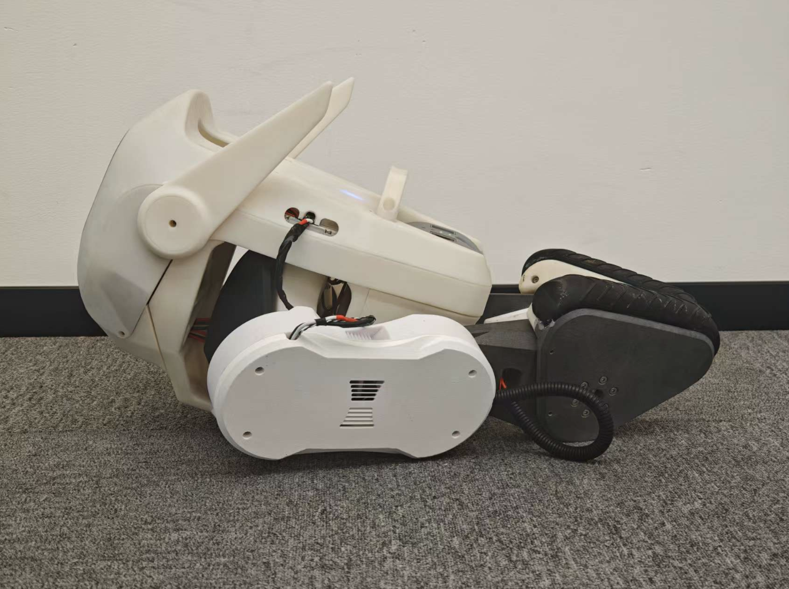
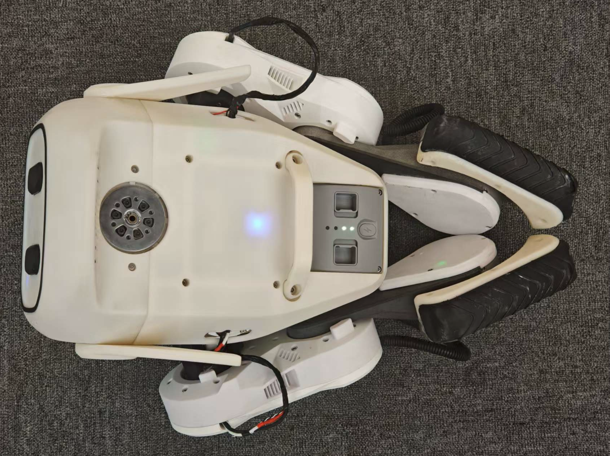

<div align="center">
  <h1 align="center">Qmini Deploy</h1>
  <p align="center">
    <a href="README.md">🌎 English</a> | <span>🇨🇳 中文</span>
  </p>
</div>

---

## 环境要求

- OS: Ubuntu 20.04 或 Ubuntu 22.04
- CPU: aarch64 或 x86_64
- Compiler: gcc version 9.4.0 或更高版本

## 安装依赖库

### 安装手柄库

安装 SDL2 库
```bash
sudo apt install libsdl2-dev
```

读取手柄设备需要权限，需要将当前用户添加到 input 组，否则报错检测不到设备。重启后生效。
```bash
sudo usermod -aG input $USER
```

### 安装串口库

```bash
sudo apt install libserial-dev
```

### 安装矩阵运算库

```bash
sudo apt install libeigen3-dev
```

## 编译

```bash
cd qmini_deploy
mkdir build && cd build
cmake ..
make -j$(nproc)
```

## 使用

### 根据硬件 id 修改配置文件

将 USB 转 4 路 485 模块和 IMU 连接到 Qmini 开发板上，使用下列命令检查硬件 id：
```bash
ls /dev/serial/by-id/
```

打印结果示例：
```
/dev/serial/by-id/usb-Silicon_Labs_CP2102_USB_to_UART_Bridge_Controller_0003-if00-port0
/dev/serial/by-id/usb-FTDI_USB__-__Serial_Converter_FTA5OHMV-if00-port0
/dev/serial/by-id/usb-FTDI_USB__-__Serial_Converter_FTA5OHMV-if01-port0
/dev/serial/by-id/usb-FTDI_USB__-__Serial_Converter_FTA5OHMV-if02-port0
/dev/serial/by-id/usb-FTDI_USB__-__Serial_Converter_FTA5OHMV-if03-port0
```

根据上述结果，修改 `qmini_config.yaml` 文件对应的端口名即可。

### 机器人操作说明

由于 GO-M8010-6 电机为单编码器，断电后无法记忆关节角度，故机器人每次需要在固定姿态开机启动。

首先将机器人摆到如下姿态，注意让机器人处于仰头状态，并且膝关节、踝关节均关节限位。

<div align="center">

| <div align="center"> 正视图 </div> | <div align="center"> 俯视图 </div> |
|--- | --- |
|  |   |

</div>

然后运行下列程序：
```bash
cd qmini_deploy
./build/main
```

程序运行后，机器人各关节会自动进入阻尼状态。

将机器人提起，遥控器按 **A** 进入锁定站立状态，机器人各关节会在数秒内转动到指定位置，此时将机器人放下即可静态站立。


<div align="center">
  
</div>


遥控器按 **X** 进入强化学习状态，此时机器人处于强化学习静态站立状态，可遥控机器人前进左右运动。

<div align="center">
  
</div>

遥控器按 **B** 进入阻尼状态。

机器人内置摔倒保护程序，当 roll 角和 pitch 角大于一定值时，会认为机器人即将摔倒，自动进入阻尼状态。

## 开机自启动配置方法

### 说明

可以配置 Qmini 机器人开机自动运行程序，避免每次开机都需要执行命令启动机器人。

### 创建开机自启动脚本

假设用户名为 `ubuntu22`，使用下列命令创建开机自启动脚本并赋予可执行权限：
```bash
vim /home/ubuntu22/qmini_startup.sh
sudo chmod +x /home/ubuntu22/qmini_startup.sh
```

脚本内容为：
```
#!/bin/bash
sleep 3
cd /home/ubuntu22/qmini/qmini_deploy/build
sudo ./main
```

### 创建开机自启动服务

```bash
sudo vim /etc/systemd/system/qmini_startup.service
```

服务文件内容为：
```
[Unit]
Description=Qmini Startup Service
After=network.target

[Service]
ExecStart=/home/ubuntu22/qmini_startup.sh
User=ubuntu22
Restart=always

[Install]
WantedBy=multi-user.target
```

### 启用开机自启动服务

```bash
sudo systemctl enable qmini_startup.service
```

### 为可执行文件添加权限

```bash
sudo visudo
```

文件末尾添加一行
```
ubuntu22 ALL=(ALL) NOPASSWD: /home/ubuntu22/qmini/qmini_deploy/build/main
```

### 重启

```bash
sudo reboot
```